<div align="center">

# EdgeSentinel「边缘智哨」

### 运行在 Jetson Nano 上的可信视觉 Agent Harness

让边缘设备不止“看见”，还能调用工具、核验证据、约束风险并在故障后恢复。

[](https://github.com/zja0011/edgesentinel-visionops/actions/workflows/ci.yml)
[](https://developer.nvidia.com/embedded/jetson-nano)
[](https://www.python.org/)
[](https://modelcontextprotocol.io/)
[](#快速验证)
[](LICENSE)

[▶ 在线播放 8 段原始演示](https://zja0011.github.io/edgesentinel-visionops/video-gallery.html) · [⚡ 5 分钟快速验证](#快速验证) · [📦 Release 与 SBOM](https://github.com/zja0011/edgesentinel-visionops/releases/tag/v0.1.0-dev.1) · [📚 文档导航](#文档导航)

</div>

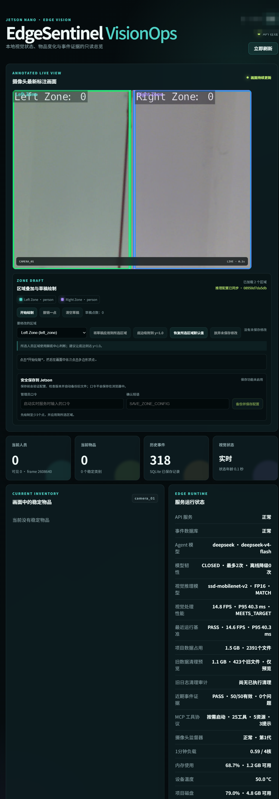

EdgeSentinel VisionOps 不是“摄像头接一个大模型”的一次性脚本。它把**实时视觉、结构化事件、证据链、Agent 工具调用、MCP、权限策略、模型降级、可观测性与灾难恢复**组织成一套可验证的边缘智能体工程。

项目在真实 Jetson Nano、USB 摄像头、Docker 与 systemd 环境中持续验收；在线模式连接 DeepSeek，网络或模型不可用时可明确降级到确定性离线规则，同时继续读取本地实时视觉结果。

> [!NOTE]
> 本页媒体均采集自真实 Jetson Nano 实验环境。为完整呈现实验过程，演示素材保留原始画面、分辨率与音轨；生产部署应另行执行人物授权、标识脱敏和最小披露审查。

### 30 秒看懂

| 看得见 | 会行动 | 可治理 | 能恢复 |
| --- | --- | --- | --- |
| Jetson 实时检测、跟踪、区域与库存 | Agent 按需选择 Tool / Skill / MCP | L0–L3、RBAC、确认门与脱敏 Trace | systemd、熔断降级、加密备份与恢复演练 |

### English overview

EdgeSentinel VisionOps is a self-hosted **Jetson Nano edge AI video analytics and Agent Harness** platform. It combines real-time object detection and tracking, people counting, zone events, inventory monitoring, tamper-evident event evidence, MCP tools, DeepSeek online/offline switching, policy-gated tool calling, observability, encrypted backup and disaster recovery in one verifiable computer-vision system.

## 目录

- [为什么是 EdgeSentinel](#为什么是-edgesentinel)
- [English overview](#english-overview)
- [核心能力](#核心能力)
- [硬件与器材](#硬件与器材)
- [系统架构](#系统架构)
- [安全与治理](#安全与治理)
- [实机证据与演示素材](#实机证据与演示素材)
- [快速验证](#快速验证)
- [部署到 Jetson Nano](#部署到-jetson-nano)
- [可以怎样提问](#可以怎样提问)
- [项目结构](#项目结构)
- [质量与可验证发布](#质量与可验证发布)
- [文档导航](#文档导航)
- [路线图](#路线图)
- [参与贡献](#参与贡献)

## 为什么是 EdgeSentinel

多数边缘视觉示例止步于“模型识别到了什么”。EdgeSentinel 继续回答四个工程问题：

1. **识别结果怎样成为可查询、可追溯的事件？**
2. **Agent 调用设备工具时，怎样限制权限与副作用？**
3. **网络、模型、摄像头或服务异常时，系统怎样降级与恢复？**
4. **怎样证明一次回答、一次动作和一份发布包确实可信？**

| 常见视觉 Demo | EdgeSentinel VisionOps |
| --- | --- |
| 只显示检测框 | 生成结构化事件、证据图、SQLite/JSONL 记录与完整性摘要 |
| 模型直接面对全部工具 | 本地确定性路由，最多暴露有界候选工具 |
| 写操作立即执行 | L1/L2/L3 风险分级、RBAC、确认短语和 Checkpoint 恢复 |
| 在线模型失败即不可用 | 有界重试、熔断、半开探测和明确标注的离线降级 |
| 只看最终回答 | Workbench 展示脱敏 Trace、工具结果、预算、Hooks 与生命周期 |
| 能运行但难发布 | 650+ 单元测试、发布边界扫描、CycloneDX SBOM 和内容寻址清单 |

## 核心能力

### 视觉与事件

- Jetson Nano 实时目标检测、IoU 跟踪、人员计数与区域判断；
- 人员进入/离开、物品出现/移除、遗留物品、摄像头离线/恢复等事件；
- 事件证据 JPEG、SHA-256 校验、稳定游标分页与北京时间趋势分析；
- 当前库存、轨迹历史、区域人数、事件对比与参考基线查询。

### Agent Harness

- Tool Registry、Policy Engine、Context Engine、Agent Loop 与 Checkpoint；
- 版本固定的 Skills、生命周期 Hooks、会话记忆和确认门控的长期记忆；
- 异步 Job、SSE 流式状态、幂等提交、执行预算与协作取消；
- 在线 DeepSeek 与确定性离线模式，可在 Dashboard 中受控切换。

### 工具与 MCP

- 本地工具统一通过 JSON Schema 注册、参数校验和风险策略执行；
- MCP stdio Server 暴露有界只读工具、Resources 与 Prompts；
- 外部天气工具与设备工具共用路由、审计和预算边界；
- 未注册、未路由或越权工具默认拒绝。

### 运行与恢复

- Docker 隔离、systemd 开机托管、摄像头监督与自动恢复；
- 本地认证、RBAC、CSRF、HTTPS、证书固定与 TLS 轮换；
- 加密异机备份、容量预览、恢复演练和 Windows 定时同步；
- 发布内容清单、CycloneDX 1.7 SBOM 与 GitHub Actions 验证。

## 硬件与器材

| 器材 | 连接方式 | 在项目中的作用 |
| --- | --- | --- |
| NVIDIA Jetson Nano 开发板 | 核心设备 | 运行视觉推理、Agent Harness、API、Dashboard 与本地数据服务 |
| USB 摄像头 | USB 接入 Jetson | 提供实时视频流和事件证据画面 |
| USB Wi‑Fi 适配器 | USB 接入 Jetson | 接入局域网，供 PC 通过 SSH/HTTPS 管理，也用于受控访问 DeepSeek 与天气服务 |
| HDMI 显示器 | HDMI 接入 Jetson | 本地桌面调试、启动排障与实时视觉观察 |
| USB 键盘、鼠标 | USB 接入 Jetson | 首次配置、本地维护和网络异常时的应急操作 |
| PC 电脑 | Wi‑Fi 局域网 | 编写和同步代码、PowerShell 验收、浏览 Dashboard、SSH/SCP 运维及异机备份 |
| 稳定电源适配器 | DC 供电 | 为开发板、摄像头及 USB 外设提供稳定电源，避免欠压导致启动或推理异常 |
| microSD / 系统存储 | Jetson 本地存储 | 保存系统、项目代码和受保留策略约束的运行数据 |

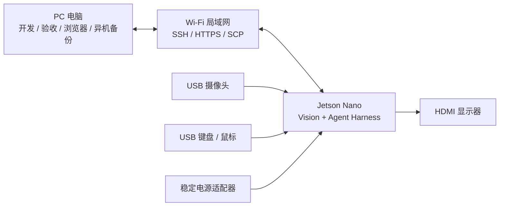
```mermaid
flowchart LR
    PC["PC 电脑\n开发 / 验收 / 浏览器 / 异机备份"]
    WIFI["Wi-Fi 局域网\nSSH / HTTPS / SCP"]
    JETSON["Jetson Nano\nVision + Agent Harness"]
    CAMERA["USB 摄像头"]
    DISPLAY["HDMI 显示器"]
    INPUT["USB 键盘 / 鼠标"]
    POWER["稳定电源适配器"]

    PC <--> WIFI <--> JETSON
    CAMERA --> JETSON
    JETSON --> DISPLAY
    INPUT --> JETSON
    POWER --> JETSON
```

PC 不参与边缘推理：即使 PC 关闭，Jetson 上由 systemd 托管的视觉与 Agent 服务仍可独立运行。PC 主要承担开发、远程管理、Dashboard 操作和异机恢复副本保存。

## 系统架构

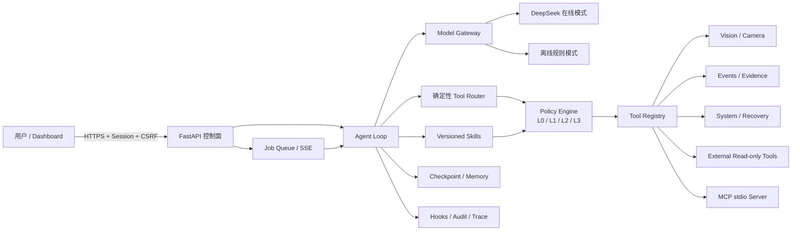
```mermaid
flowchart LR
    U["用户 / Dashboard"] -->|HTTPS + Session + CSRF| API["FastAPI 控制面"]
    API --> JOB["Job Queue / SSE"]
    API --> LOOP["Agent Loop"]
    JOB --> LOOP

    LOOP --> ROUTER["确定性 Tool Router"]
    LOOP --> SKILL["Versioned Skills"]
    LOOP --> MODEL["Model Gateway"]
    MODEL --> REMOTE["DeepSeek 在线模式"]
    MODEL --> OFFLINE["离线规则模式"]

    ROUTER --> POLICY["Policy Engine\nL0 / L1 / L2 / L3"]
    SKILL --> POLICY
    POLICY --> REGISTRY["Tool Registry"]

    REGISTRY --> VISION["Vision / Camera"]
    REGISTRY --> EVENTS["Events / Evidence"]
    REGISTRY --> SYSTEM["System / Recovery"]
    REGISTRY --> EXT["External Read-only Tools"]

    LOOP --> STATE["Checkpoint / Memory"]
    LOOP --> TRACE["Hooks / Audit / Trace"]
    REGISTRY --> MCP["MCP stdio Server"]
```

一条工具调用必须依次通过：

```text
自然语言意图
  -> 本地工具路由
  -> 模型决策或离线规则
  -> Schema 参数校验
  -> 风险策略与角色校验
  -> 必要时等待用户确认
  -> 工具执行
  -> 脱敏 Trace / Audit / Checkpoint
```

## 安全与治理

| 等级 | 含义 | 示例 | 默认行为 |
| --- | --- | --- | --- |
| L0 | 只读、本地或明确标注的外部查询 | 人数、事件、天气、设备健康 | 可自动执行 |
| L1 | 可恢复的业务写入 | 保存快照、生成报告、确认事件、记忆写入 | 必须确认 |
| L2 | 影响运行状态或本地数据 | 重启推理、按预览清理数据 | 管理员确认 |
| L3 | 关键恢复或高影响操作 | 保留给灾备恢复等关键流程 | 默认拒绝并强化确认 |

安全设计不是 Prompt 约定，而是服务端代码边界：

- **Default deny**：未注册、未路由和未授权工具全部拒绝；
- **最小工具面**：普通问题不发送工具 Schema，匹配任务最多暴露有界候选；
- **凭据隔离**：模型 Key、认证哈希、TLS 私钥与备份口令由 root 专用文件保存；
- **外部 HTTPS**：启用 TLS 后，明文写请求拒绝，Cookie 使用 Secure/HttpOnly/SameSite；
- **副作用不重放**：模型重试不会重新执行已经产生副作用的工具；
- **发布边界**：运行数据、证据、模型 Engine、凭据与恢复备份不会进入公开仓库和发布包。

漏洞报告方式见 [SECURITY.md](SECURITY.md)。

## 实机证据与演示素材

以下实机证据展示硬件工作台、Dashboard、Agent Workbench、MCP 工具目录和 Jetson 验收结果，便于访客直接核对系统的运行形态与工程闭环。

### 实机工作台

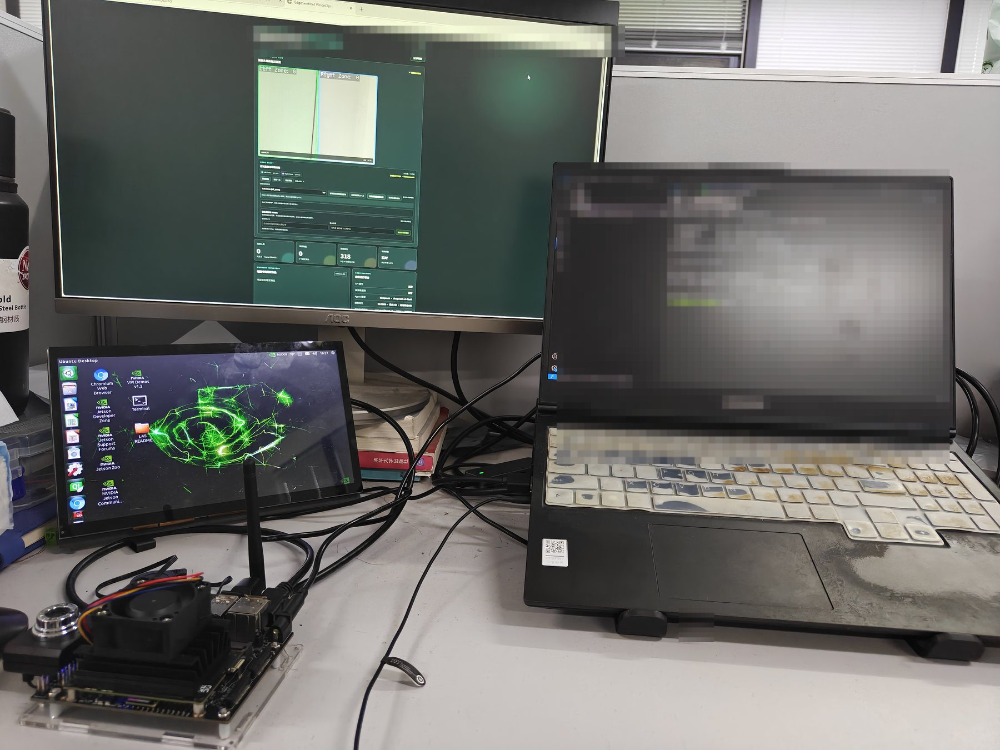

*PC 通过局域网管理 Jetson，Jetson 独立运行 Dashboard、视觉流水线和本地数据服务。*

### 实时视觉与事件闭环


*总览长图依次展示实时视觉、区域配置、人员与库存统计、事件中心、运行状态和 Agent Copilot。*

<table>
  <tr>
    <td width="50%">
      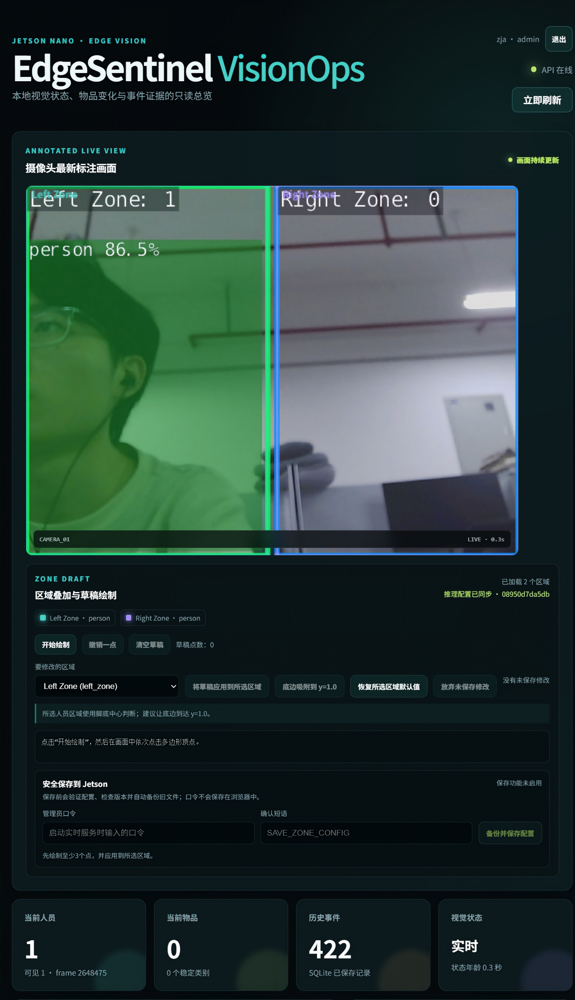
      <br><sub>实时人员检测、区域覆盖与汇总计数</sub>
    </td>
    <td width="50%">
      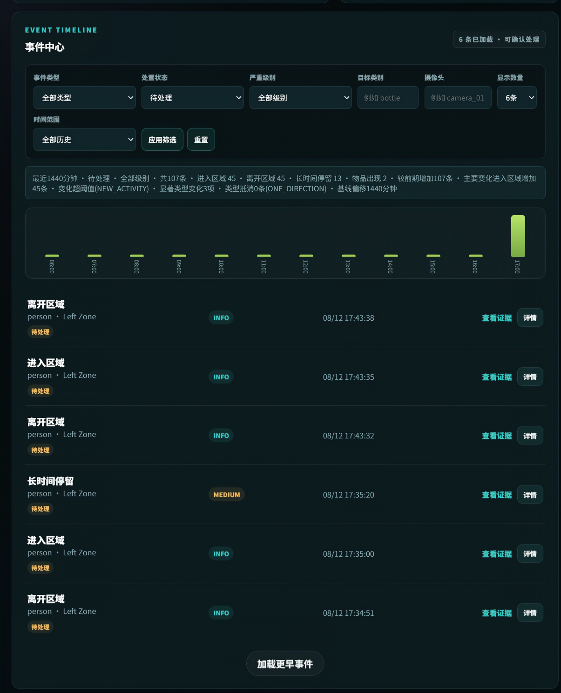
      <br><sub>事件中心、筛选、趋势及可核验证据入口</sub>
    </td>
  </tr>
</table>

### Agent Harness：不是只有最终回答

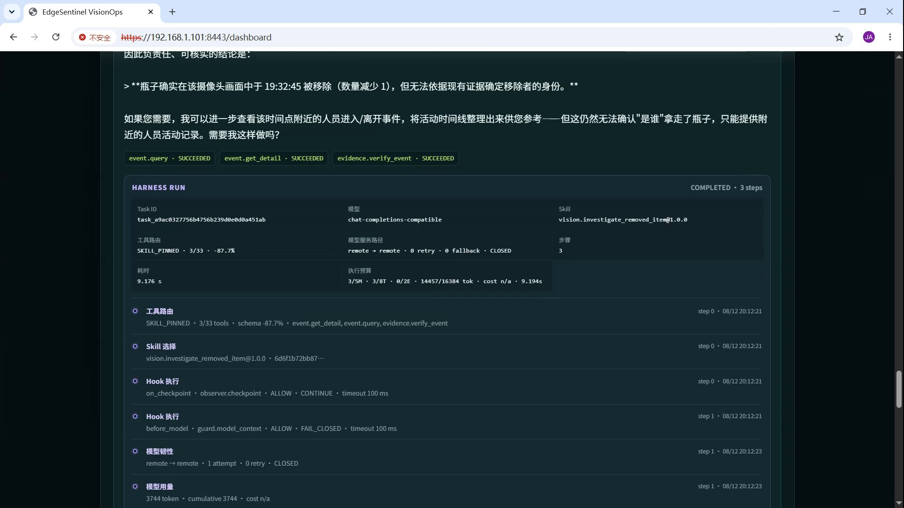

*一次三步调查同时显示版本固定 Skill、限定工具、`remote → remote`、执行预算、Hooks 与脱敏 Trace。*

<table>
  <tr>
    <td width="50%">
      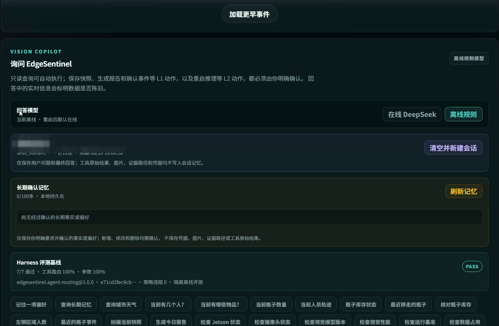
      <br><sub>在线 DeepSeek / 离线规则受控切换，重启默认仍为在线</sub>
    </td>
    <td width="50%">
      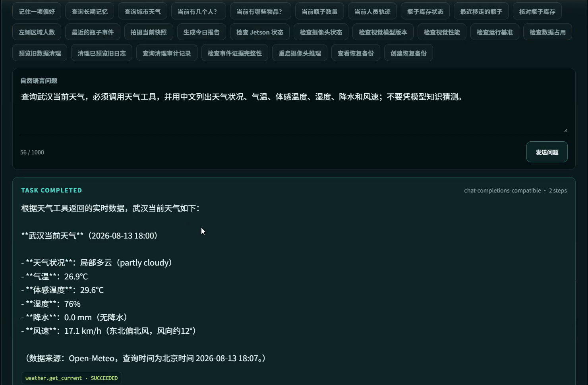
      <br><sub>外部只读工具：Open‑Meteo 实时天气与成功工具标签</sub>
    </td>
  </tr>
</table>

### MCP 与可验证发布

<table>
  <tr>
    <td width="50%">
      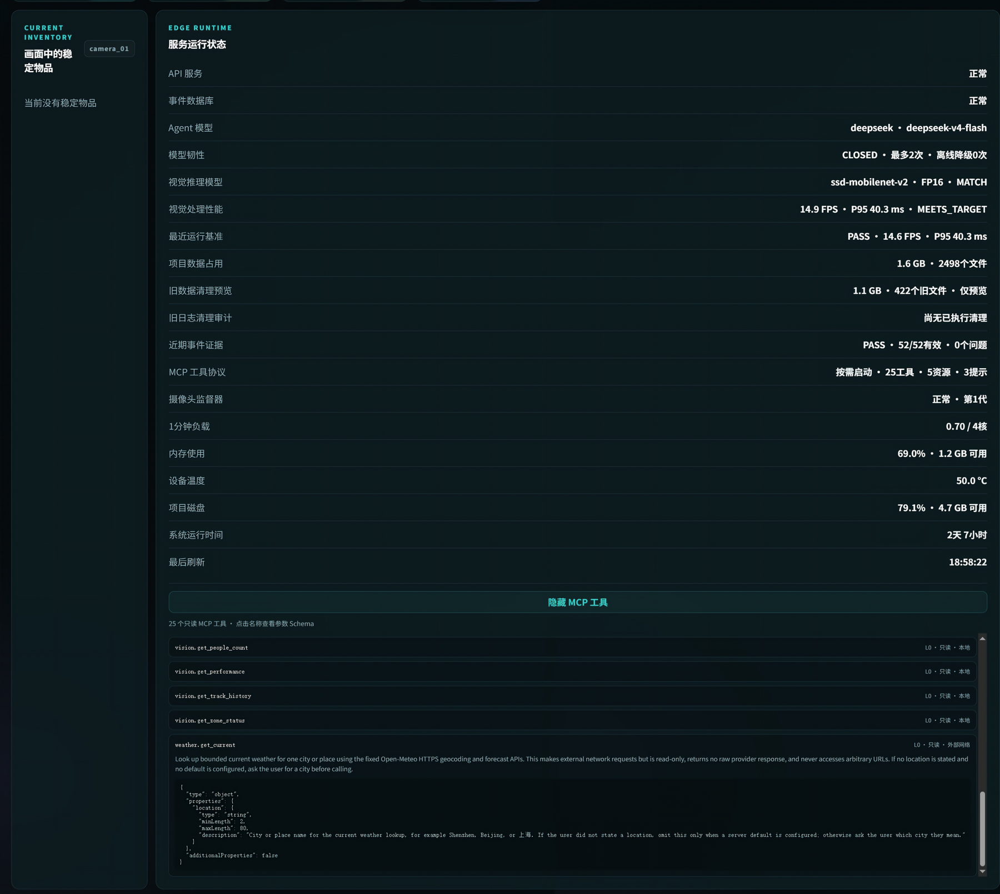
      <br><sub>MCP Catalog：25 个只读工具、5 Resources、3 Prompts 与参数 Schema</sub>
    </td>
    <td width="50%">
      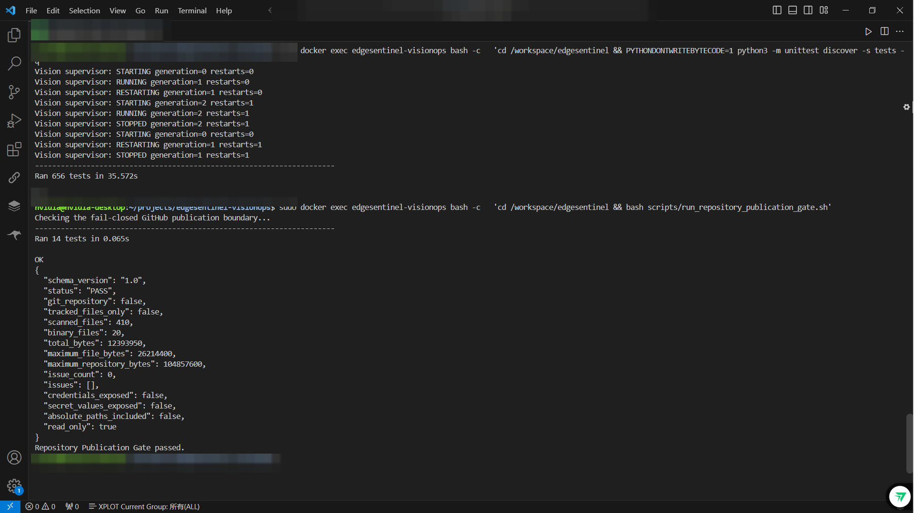
      <br><sub>656 个测试通过；发布边界确认无凭据、秘密值与绝对路径</sub>
    </td>
  </tr>
</table>

### 功能演示视频

8 段实录以**原始 MP4**发布：不压缩、不转码、不裁剪、不移除音轨，也不添加遮挡。原文件由 [`v0.1.0-dev.1`](https://github.com/zja0011/edgesentinel-visionops/releases/tag/v0.1.0-dev.1) Release 承载，不写入 Git 历史；GitHub Pages 仅提供播放器界面。

> **点击卡片即可在线播放**：进入 [EdgeSentinel 原始演示视频展厅](https://zja0011.github.io/edgesentinel-visionops/video-gallery.html)。如果浏览器不支持某段原始视频的编码，展厅仍提供原文件下载入口。

<table>
  <tr>
    <td width="50%"><a href="https://zja0011.github.io/edgesentinel-visionops/video-gallery.html#demo-01">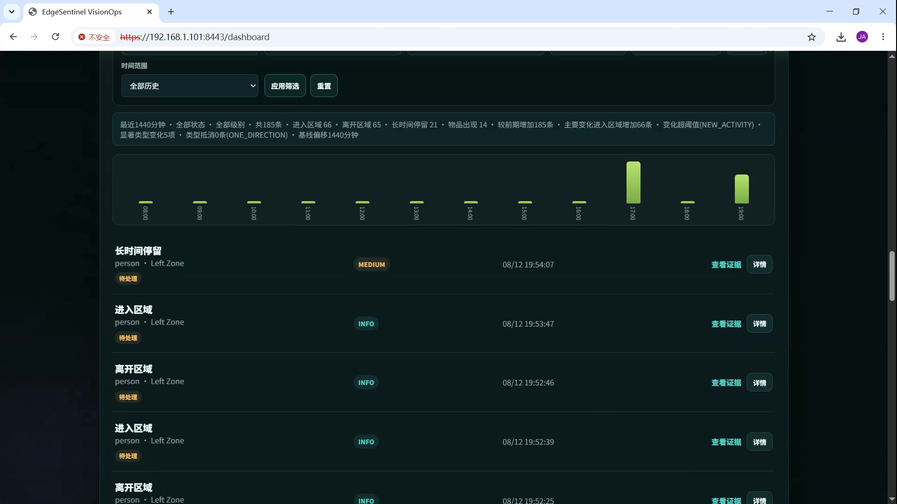<br><b>▶ 01 · 端到端</b></a><br><sub>实时视觉 → Agent → Workbench → 事件证据 → MCP</sub></td>
    <td width="50%"><a href="https://zja0011.github.io/edgesentinel-visionops/video-gallery.html#demo-02">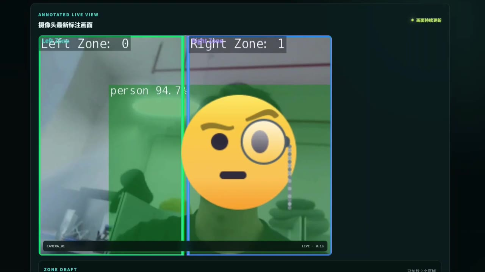<br><b>▶ 02 · 实时视觉</b></a><br><sub>人数变化、区域移动、物体检测与稳定库存</sub></td>
  </tr>
  <tr>
    <td><a href="https://zja0011.github.io/edgesentinel-visionops/video-gallery.html#demo-03">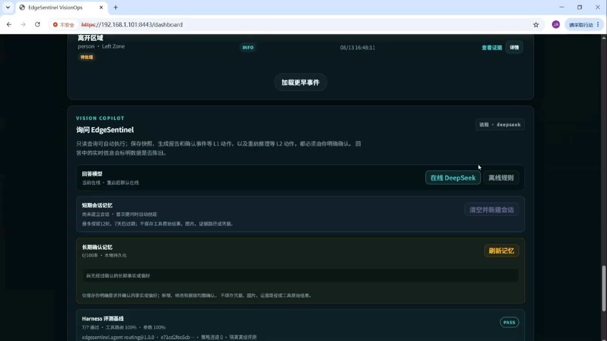<br><b>▶ 03 · 区域事件</b></a><br><sub>进入 → 停留 → 离开及匿名 Track ID 核对</sub></td>
    <td><a href="https://zja0011.github.io/edgesentinel-visionops/video-gallery.html#demo-04">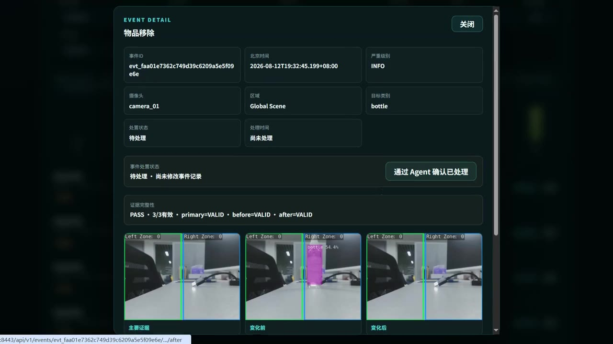<br><b>▶ 04 · 物品生命周期</b></a><br><sub>放入瓶子、稳定库存、移除与前后证据</sub></td>
  </tr>
  <tr>
    <td><a href="https://zja0011.github.io/edgesentinel-visionops/video-gallery.html#demo-05">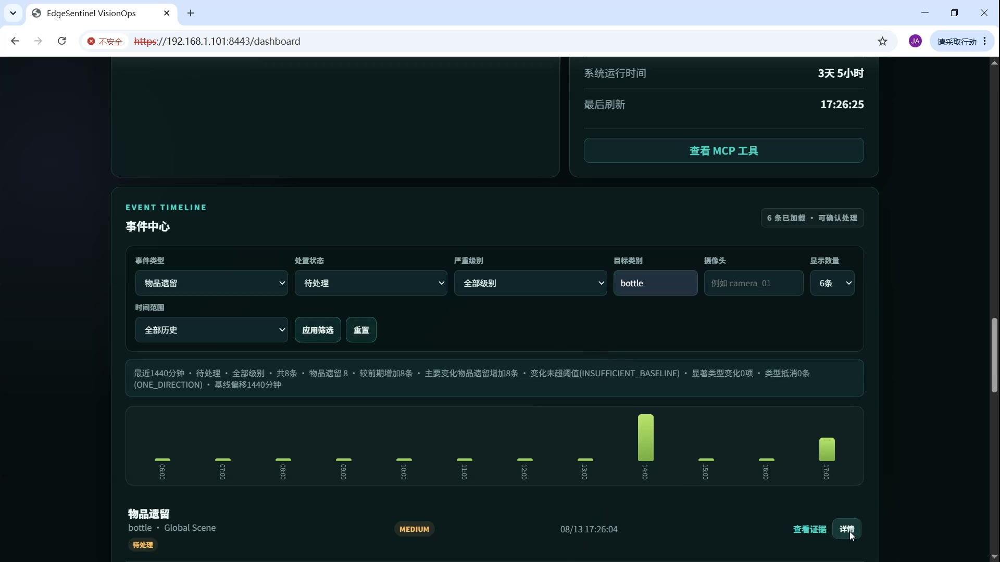<br><b>▶ 05 · 物品遗留</b></a><br><sub>人员离开、连续无人确认与遗留事件</sub></td>
    <td><a href="https://zja0011.github.io/edgesentinel-visionops/video-gallery.html#demo-06">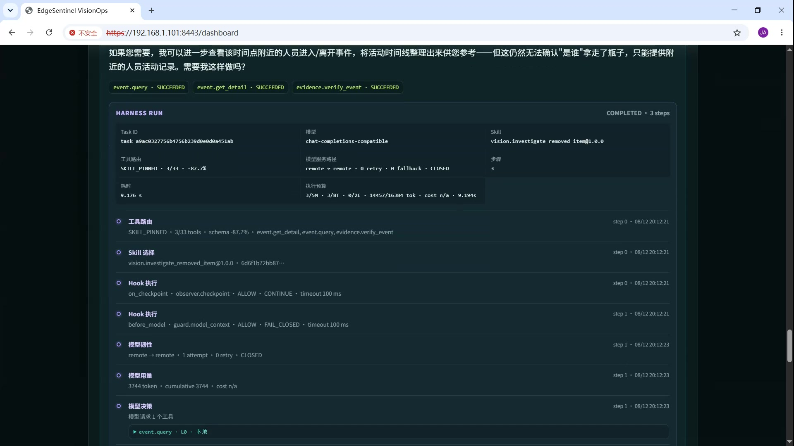<br><b>▶ 06 · Agent Harness</b></a><br><sub>Skill、工具路由、Hooks、预算和脱敏 Trace</sub></td>
  </tr>
  <tr>
    <td><a href="https://zja0011.github.io/edgesentinel-visionops/video-gallery.html#demo-07">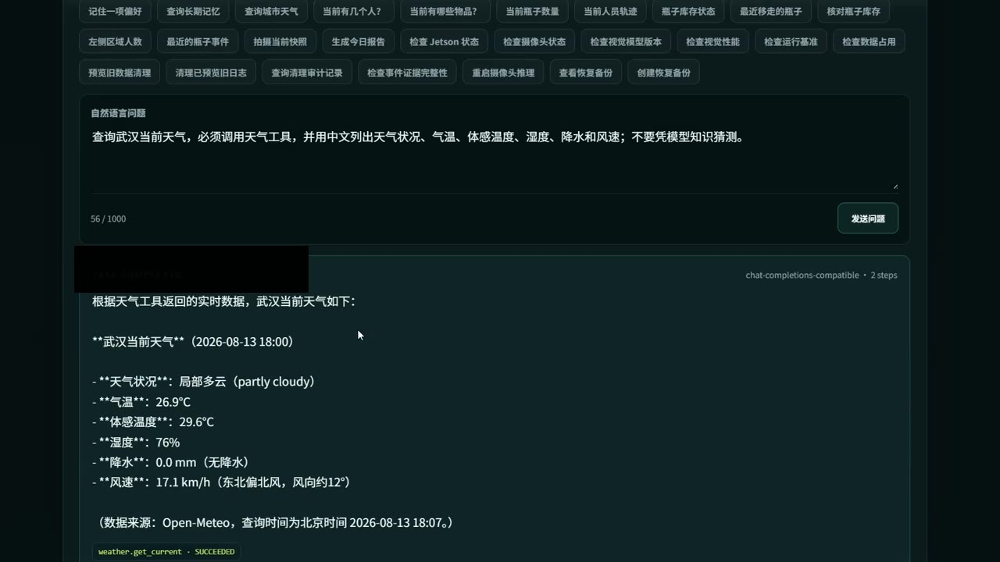<br><b>▶ 07 · 在线 / 离线工具</b></a><br><sub>DeepSeek、Open‑Meteo、离线本地视觉与恢复在线</sub></td>
    <td><a href="https://zja0011.github.io/edgesentinel-visionops/video-gallery.html#demo-08">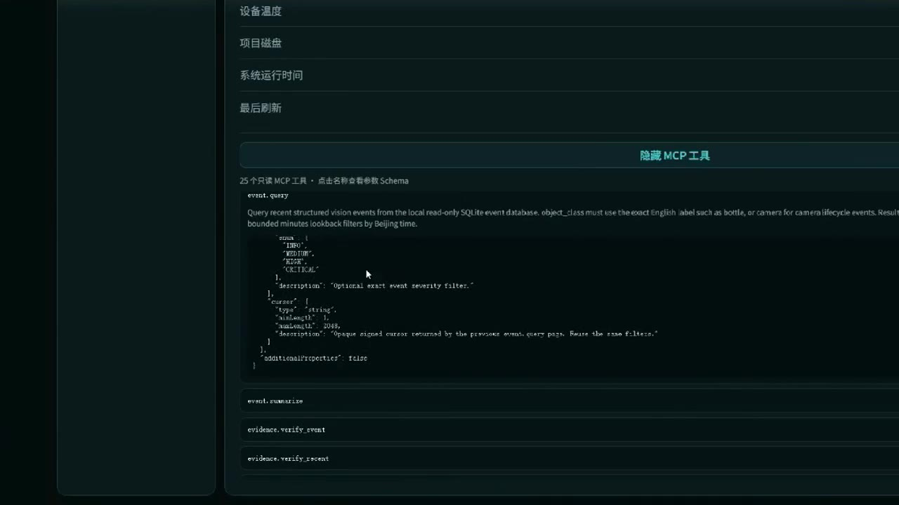<br><b>▶ 08 · MCP Server</b></a><br><sub>Catalog、Schema、stdio、Resources 与默认拒绝</sub></td>
  </tr>
</table>

[查看原始视频校验清单（SHA‑256、字节数、时长与编码）](https://github.com/zja0011/edgesentinel-visionops/releases/download/v0.1.0-dev.1/video-original-manifest.json)

当前素材状态：

| 素材 | 状态 | 计划位置 |
| --- | --- | --- |
| Jetson + 摄像头 + Wi‑Fi + HDMI 实机总览 | 已公开 | `docs/media/hardware/rig-overview.jpg` |
| PC Dashboard 与 Jetson 同框 | 已公开 | `docs/media/hardware/lab-workbench.jpg` |
| Dashboard 总览、实时检测与事件中心 | 已公开 | `docs/media/dashboard/` |
| Agent Workbench、模型切换与天气工具 | 已公开 | `docs/media/dashboard/` |
| MCP Catalog 与 JSON Schema | 已公开 | `docs/media/dashboard/mcp-catalog.png` |
| 测试与仓库发布边界 | 已公开 | `docs/media/release/quality-gates.png` |
| 一镜到底及专项演示视频 | 8 段原始视频已完成 | [在线播放展厅](https://zja0011.github.io/edgesentinel-visionops/video-gallery.html) · [`v0.1.0-dev.1` Release](https://github.com/zja0011/edgesentinel-visionops/releases/tag/v0.1.0-dev.1) |

优先拍摄顺序、每段视频的镜头脚本、隐私检查和文件规格见：

- [实机素材拍摄与录屏清单](docs/media-capture-guide.md)
- [全功能素材拍摄清单](docs/media/shot-checklist.md)
- [媒体目录说明](docs/media/README.md)

每段 Release 视频均附 SHA‑256 Manifest，可用于核对下载文件的完整性；GitHub Pages 仅提供在线播放界面，不生成二次压缩版本。

## 快速验证

无需 Jetson 即可先验证 Harness、策略、发布边界和纯软件逻辑：

```bash
git clone https://github.com/zja0011/edgesentinel-visionops.git
cd edgesentinel-visionops
python -m unittest discover -s tests -q
python -m apps.repository_publication_gate
```

期望结果：

```text
Ran 650+ tests
OK

"status": "PASS"
"credentials_exposed": false
"absolute_paths_included": false
```

生成并校验发布清单与 SBOM：

```bash
bash scripts/build_release_artifacts.sh
bash scripts/check_release_integrity.sh
```

## 部署到 Jetson Nano

### 环境要求

- NVIDIA Jetson Nano / JetPack 4；
- NVIDIA `jetson-inference` 容器环境；
- 可用摄像头设备，例如 `/dev/video0`；
- Docker 与 systemd；
- 局域网内用于访问 Dashboard 的客户端。

### 安全启动顺序

在 Jetson 主机执行：

```bash
git clone https://github.com/zja0011/edgesentinel-visionops.git
cd edgesentinel-visionops

bash scripts/install_host_service.sh
bash scripts/configure_auth_boot.sh install

# 可选：开机自动连接 DeepSeek；没有凭据时自动使用离线模式
bash scripts/configure_deepseek_boot.sh install

# 推荐：局域网 HTTPS
bash scripts/configure_tls_boot.sh install

sudo systemctl restart edgesentinel-visionops.service
bash scripts/check_systemd_runtime.sh
```

启用 TLS 后访问：

```text
https://<JETSON_IP>:8443/dashboard
```

> [!WARNING]
> 不要把 8000/8443 端口直接映射到公网。自签名证书适用于受信局域网和证书固定；公网部署应使用组织 CA 或 ACME 证书。

完整的历史部署步骤与每阶段验收命令见[实现演进日志](docs/implementation-journal.md)。

## 可以怎样提问

在线模型会理解自然语言改写；离线规则模式也覆盖常用中文同义表达。

```text
现在摄像头里站着几位？
左侧区域现在有人吗？
瓶子的库存和预期一致吗？
最近移走了哪些物品？
检查这条事件的证据是否完整。
过去 24 小时事件相比前一天变化多大？
武汉现在天气怎样？
拍一张当前快照。（L1，需要确认）
重启摄像头推理。（L2，需要管理员确认）
```

通用问题可以由在线 DeepSeek 回答；视觉问题会按需选择工具，而不是把整个工具目录无条件发送给模型。

## 项目结构

```text
edgesentinel-visionops/
├─ apps/                 # API、Dashboard、CLI、MCP 与运维入口
├─ packages/
│  ├─ vision/            # 推理、帧状态与可视化
│  ├─ analytics/         # 人数、区域、库存、遗留物分析
│  ├─ events/            # 事件模型、存储与汇总
│  ├─ evidence/          # 证据生成与完整性校验
│  ├─ harness/           # Agent Loop、Policy、Skills、Memory、Trace
│  └─ mcp/               # MCP Server、Client、Resources、Prompts
├─ skills/               # 版本化 Agent Skills
├─ evals/                # 离线路由评估数据集
├─ deploy/               # systemd 单元模板
├─ scripts/              # 安装、验收、备份、发布与恢复脚本
├─ tests/unit/           # 650+ 单元测试
├─ docs/                 # 运维、安全、发布与素材文档
└─ vendor/wheels/        # JetPack 4 / Python 3.6 离线依赖
```

## 质量与可验证发布

主分支由 GitHub Actions 执行：

1. 公开仓库边界与敏感信息扫描；
2. 固定依赖安装；
3. 完整单元测试；
4. 确定性 release provenance 验证；
5. CycloneDX 1.7 SBOM 生成与完整性校验；
6. 验证产物限时留存。

本地发布检查：

```bash
bash scripts/run_repository_publication_gate.sh
bash scripts/run_release_provenance_test.sh
bash scripts/build_release_artifacts.sh
bash scripts/check_release_integrity.sh
```

发布包明确排除：

```text
data/  dist/  credentials  TLS private keys
model engines  evidence  recovery backups  absolute host paths
```

## 文档导航

| 文档 | 内容 |
| --- | --- |
| [实机素材拍摄与录屏清单](docs/media-capture-guide.md) | 照片、截图、视频的优先级与执行脚本 |
| [全功能素材拍摄清单](docs/media/shot-checklist.md) | 每张照片、截图与视频的编号、命名、动作和验收标准 |
| [实现演进日志](docs/implementation-journal.md) | 从视觉 Demo 到生产级 Harness 的完整阶段记录 |
| [灾难恢复](docs/disaster-recovery.md) | 备份、恢复预览、加密异机导出与演练 |
| [TLS 运维](docs/tls-operations.md) | HTTPS、证书固定、轮换与恢复 |
| [发布来源与 SBOM](docs/release-provenance.md) | 内容寻址清单、供应链边界与验证 |
| [GitHub 发布流程](docs/github-release.md) | 分支保护、标签和 Release 流程 |
| [贡献指南](CONTRIBUTING.md) | 开发、测试与提交约定 |
| [安全策略](SECURITY.md) | 漏洞报告与敏感信息边界 |

## 路线图

- [x] 实时检测、跟踪、区域、库存与事件证据
- [x] Agent Loop、Tool Registry、Policy、Checkpoint 与 Workbench
- [x] MCP Server/Client、Resources、Prompts 与版本化 Skills
- [x] 在线/离线模型切换、预算、熔断与降级
- [x] RBAC、HTTPS、systemd、灾备与异机恢复演练
- [x] CI、发布门禁、CycloneDX SBOM 与内容寻址清单
- [x] 补齐实机照片、Dashboard 截图和 8 段功能演示视频
- [ ] 多摄像头适配与更完整的真实场景评估集
- [ ] 受控的第三方 MCP Server 安装与租户隔离
- [ ] 面向新版本 Jetson/JetPack 的迁移验证

## 参与贡献

欢迎提交 Issue 和 Pull Request。涉及设备写操作、外部网络、认证、恢复或数据删除的改动，请同时提供风险级别、失败模式、回滚方案和测试证据。

- License：[Apache-2.0](LICENSE)
- Contributing：[CONTRIBUTING.md](CONTRIBUTING.md)
- Security：[SECURITY.md](SECURITY.md)
